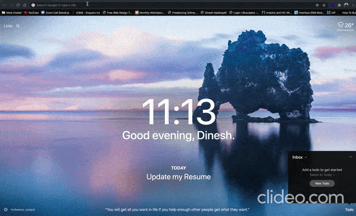

## Project Overview

A NodeJS based Zoom web app clone with features such as
room creation, voice controls, video controls and chat room

Demo URL: https://murmuring-lake-56353.herokuapp.com

## Demo

  

## Project Setup

 

<ul>

### Clone the Project
- <code>git clone https://github.com/dineshnadimpalli/NodeJS-Zoom-Clone.git</code>

 

### Install Dependencies
- <code>cd NodeJS-Zoom-Clone</code>
 
- <code>npm install</code>

 

### Run the project
- <code>npm start</code>

 

### Creating Rooms
- Open http://localhost:8000 in your browser and it will automatically create a room for you by redirecting you to a different url
- To invite other people to join copy the url and share
- To create a new room hit http://localhost:8000 in your browser again

 

### Features
- Mute/Unmute audio
- Video on/off control
- Chat to share text messages

</ul>

 

### Happy Coding ✌️